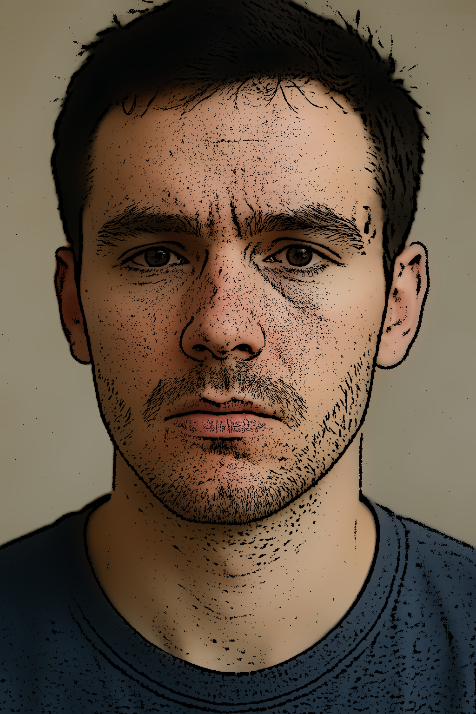

# Pencil Sketch & Cartoon Filter

This project applies image-processing techniques using OpenCV in C++:

- **Pencil Sketch**: Extracts linear, hand-drawn–style strokes by high-pass filtering the brightness channel.  
- **Cartoon Effect**: Blends a color-smoothed version of the image with the sketch strokes to produce a stylized, cartoon-like output.

---

## Example Outputs

<div style="display: flex; justify-content: center; overflow-x: auto; width: 80%;">
  <table style="table-layout: auto; border-collapse: collapse;">
    <thead>
      <tr>
        <th style="text-align: left; padding: 8px;">Original Image</th>
        <th style="text-align: left; padding: 8px;">Pencil Sketch Result</th>
        <th style="text-align: left; padding: 8px;">Cartoon Effect Result</th>
      </tr>
    </thead>
    <tbody>
      <tr>
        <td style="padding: 8px;">
          
        </td>
        <td style="padding: 8px;">
          
        </td>
        <td style="padding: 8px;">
          
        </td>
      </tr>
    </tbody>
  </table>
</div>

> **Tip**: Experiment with Gaussian kernel sizes and bilateral filter parameters to achieve different artistic styles—try larger sigma values for softer cartoons or finer strokes for sharper sketches.

---

## What It Does

This program takes a color image as input and produces two stylized versions of it:

1. **Pencil Sketch:**
   A black-and-white sketch effect is created by extracting the V (brightness) channel from the HSV color space, applying a Gaussian blur, and subtracting it from the original to highlight dark edges. The result is a clean, binary sketch emphasizing contours.

2. **Cartoonified Image:**
   A cartoon effect is generated by first applying a bilateral filter to smooth the image while preserving edges. This smoothed color image is then combined with the sketch mask, which blacks out background regions and retains only the colored contours, producing a stylized cartoon-like appearance.

The program:
* Loads the input image from disk.
* Processes it to create both the sketch and cartoon outputs.
* Displays each result in a resizable window.
* Saves the final images back to disk for later use.

---

## Build & Run Instructions

Clone the repository and build all projects in one step:

```bash
git clone https://github.com/sancho11/sketch_and_cartoon.git
cd sketch_and_cartoon
mkdir build && cd build
cmake ..
make
```

Executable will be placed in the bin directory `build/bin/sketch_and_cartoon`.

To run the project:
```bash
./bin/sketch_and_cartoon
```

---

## Pipeline Overview

<p align="center">
  
  <br><em>Pipeline Diagram</em>
</p>

---

## Key Concepts

This project combines classic image processing techniques to generate both cartoonified and pencil-sketch versions of an input image using OpenCV. Below are the core concepts and methods utilized:

* Color Space Transformation
  
    Converts the original image from BGR to HSV to isolate the Value (V) channel, which represents brightness. This separation allows targeted processing of intensity information without affecting color data.

* High-Pass Filtering for Sketching

    A pencil sketch effect is achieved by subtracting a Gaussian-blurred version of the V channel from its original. This isolates high-frequency details, i.e., edges and strokes.

    The result is then thresholded to produce a binary mask that mimics pencil shading with white strokes on a black background.

* Bilateral Filtering for Cartoon Effect

    A bilateral filter smooths the color regions of the image while preserving edges. This gives the image a flat, hand-drawn cartoon look.

    The sketch mask is then inverted and applied to the smoothed image, darkening the edges and enhancing contrast for a stylized cartoon aesthetic.